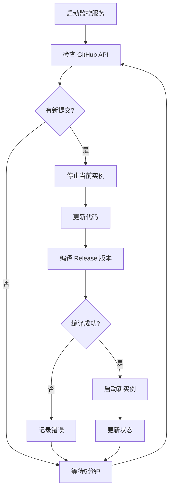

# Pumpkin 监控系统部署指南

## 系统概述

这是一个完整的自动化部署监控系统，用于监控 [Pumpkin-MC](https://github.com/Pumpkin-MC/Pumpkin) 项目的 GitHub 仓库，当有新提交时自动构建并重启服务。

## 核心特性

✅ **自动监控** - 定期检查 GitHub 主分支的新提交  
✅ **自动构建** - 使用 `cargo build --release` 编译 Rust 项目  
✅ **进程管理** - 安全停止旧实例，启动新实例  
✅ **Web 界面** - 美观的实时状态展示和日志查看  
✅ **数据持久化** - JSON 文件存储，支持随时重启  
✅ **健壮设计** - 错误重试、超时处理、异常恢复  

## 技术架构

- **语言**: Rust (async/await)
- **Web 框架**: Axum  
- **数据存储**: JSON 文件 (无需数据库)
- **监控方式**: GitHub API 轮询
- **进程管理**: 系统进程控制
- **前端**: 响应式 HTML + CSS + JavaScript

## 快速部署

### 1. 准备环境
```bash
# 确保安装了 Rust 和 Git
curl --proto '=https' --tlsv1.2 -sSf https://sh.rustup.rs | sh
```

### 2. 构建项目
```bash
cd /Users/zhaoliyan/pumpkin
./scripts/install.sh
```

### 3. 配置系统
编辑 `config.toml`:
```toml
[server]
host = "0.0.0.0"
port = 3000

[github]
repo_owner = "Pumpkin-MC"
repo_name = "Pumpkin"
branch = "main"
check_interval = 300  # 5分钟检查一次

[build]
workspace_dir = "./workspace"
binary_name = "pumpkin"
build_timeout = 1800  # 30分钟构建超时

[runtime]
restart_delay = 5
max_retries = 3
```

### 4. 启动服务
```bash
./scripts/start.sh
# 或者
cargo run --release
```

### 5. 访问界面
打开浏览器访问: `http://localhost:3000`

## 系统工作流程



## 目录结构

```
pumpkin-monitor/
├── src/                    # 源代码
│   ├── main.rs            # 主程序
│   ├── github.rs          # GitHub API 集成
│   ├── build.rs           # 构建管理
│   ├── storage.rs         # 数据存储
│   ├── web.rs             # Web 服务
│   └── types.rs           # 数据类型
├── scripts/               # 部署脚本
│   ├── install.sh         # 安装脚本
│   ├── start.sh           # 启动脚本
│   └── *.service          # systemd 服务文件
├── workspace/             # 工作目录（自动创建）
│   └── Pumpkin/          # 克隆的代码仓库
├── config.toml           # 配置文件
├── data.json            # 数据文件
└── README.md           # 文档
```

## Web 界面功能

### 首页仪表板
- 🟢/🔴 运行状态指示
- ⚙️ 当前构建状态  
- 📝 当前提交信息
- ⏱️ 运行时长统计
- 📋 构建历史记录

### API 接口
- `GET /api/status` - 系统状态
- `GET /api/builds` - 构建历史
- 支持 CORS 跨域访问

## 生产环境部署

### 使用 systemd 服务

1. **复制服务文件**:
```bash
sudo cp scripts/pumpkin-monitor.service /etc/systemd/system/
```

2. **创建专用用户**:
```bash
sudo useradd -r -s /bin/false pumpkin
sudo mkdir -p /opt/pumpkin-monitor
sudo chown pumpkin:pumpkin /opt/pumpkin-monitor
```

3. **部署文件**:
```bash
sudo cp -r * /opt/pumpkin-monitor/
sudo chown -R pumpkin:pumpkin /opt/pumpkin-monitor
```

4. **启动服务**:
```bash
sudo systemctl enable pumpkin-monitor
sudo systemctl start pumpkin-monitor
```

### 防火墙配置
```bash
# 开放 3000 端口
sudo ufw allow 3000/tcp
```

### 反向代理 (可选)
使用 Nginx 作为反向代理:
```nginx
server {
    listen 80;
    server_name your-domain.com;
    
    location / {
        proxy_pass http://127.0.0.1:3000;
        proxy_set_header Host $host;
        proxy_set_header X-Real-IP $remote_addr;
    }
}
```

## 监控和维护

### 查看日志
```bash
# systemd 日志
sudo journalctl -u pumpkin-monitor -f

# 或直接运行时的输出
./target/release/pumpkin-monitor
```

### 状态检查
```bash
# 服务状态
sudo systemctl status pumpkin-monitor

# 进程状态
ps aux | grep pumpkin
```

### 数据备份
```bash
# 备份配置和数据
cp config.toml config.toml.bak
cp data.json data.json.bak
```

## 故障排除

### 常见问题

1. **构建失败**
   - 检查磁盘空间
   - 验证网络连接
   - 查看构建日志

2. **无法连接 GitHub**
   - 检查网络设置
   - 考虑使用代理
   - 验证 API 访问

3. **进程启动失败**
   - 检查文件权限
   - 验证二进制文件
   - 查看错误日志

### 性能优化

- 调整检查间隔 (`check_interval`)
- 优化构建超时 (`build_timeout`)
- 配置日志轮转

## 安全考虑

- 使用专用用户运行服务
- 限制文件系统访问权限
- 配置防火墙规则
- 定期更新依赖

## 扩展功能

可以考虑添加的功能:
- 通知系统 (邮件/Slack/微信)
- 多仓库支持
- 构建缓存优化
- 健康检查端点
- 性能监控指标

---

**系统已就绪! 🎃**

现在你可以启动监控系统，它将自动监控 Pumpkin 项目的更新并进行自动部署。Web 界面提供了直观的状态展示，确保你随时了解系统运行情况。
